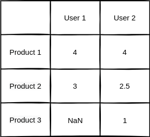
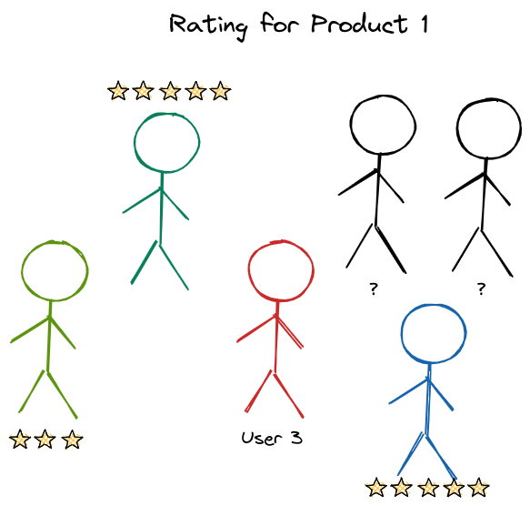
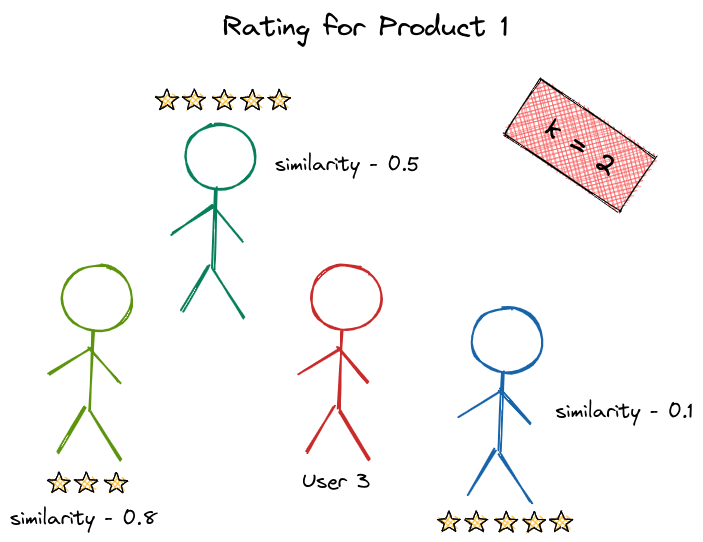
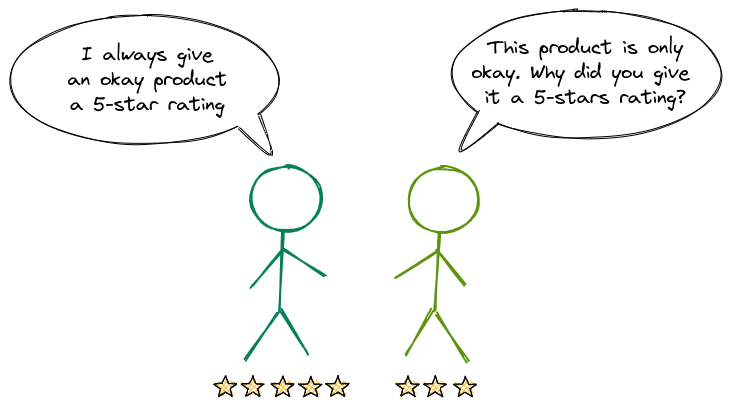
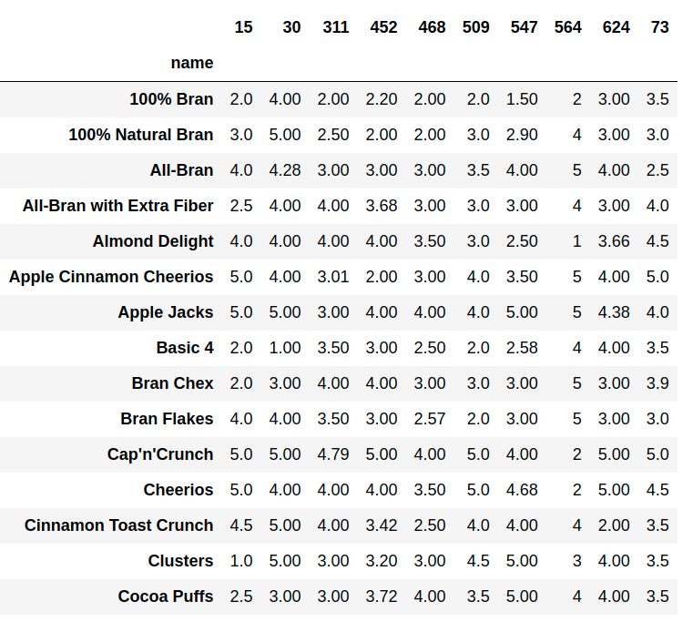

## 

## Motivation

Imagine you have a database of product ratings from different users. There are some products in the system that your users haven’t bought. How do recommend new and relevant products to your users using this data?


One straightforward approach is to guess the rating of user 1 on a product using the rating of user 2 on the same product. To increase the chance of guessing it right, user 2 should have similar rating behaviors to user 1.



After predicting all ratings, we will then recommend user 1 the products that are predicted to be highly rated by user 1.

The approach above is a simplified version of user-based collaborative filtering, where we use similarities between users to provide recommendations.

In this article, we will use collaborative filtering to fill in the missing ratings on a real product database.

## Get the Data

We will work with a sample data I created. The data can be downloaded [here](https://github.com/ocelotconsulting/cereal-rating/blob/main/data/cereal_ratings.csv). 

After saving the data under the directory `data`, load the data:
```python
import numpy as np
import pandas as pd 
ratings_df = pd.read_csv('../data/cereal_ratings.csv', index_col=0)
ratings_df
```


Note that there are some missing values in this data. We will start with finding the similarity between each pair of users.

## Find Similarities Between Users

We’ll use the [Pearson correlation coefficient](https://en.wikipedia.org/wiki/Pearson_correlation_coefficient) to find the correlation between users based on their rated products.

If two users give exactly the same ratings, the Pearson correlation is 1.
```python
user1 = [0, 1, 2]
user2 = [0, 1, 2]
np.corrcoef(user1, user2)[0, 1]
```
```bash
1.0
```

If the relative product ratings of two users increase at the same rate, the correlation is still 1.
```python
user1 = [0, 1, 2]
user2 = [0, 2, 4]
np.corrcoef(user1, user2)
```
```bash
1.0
```

If two users rate exactly opposite to each other, the correlation is -1.
```python
user1 = [0, 1, 2, 3]
user2 = [3, 2, 1, 0]
np.corrcoef(user1, user2)[0, 1]
```
```bash
-1
```

Let’s use this method to create a function that finds a correlation between two users:
```python
def find_correlation_between_two_users(ratings_df: pd.DataFrame, user1: str, user2: str):
    """Find correlation between two users based on their rated products using Pearson correlation"""
    rated_products_by_both = ratings_df[[user1, user2]].dropna(axis=0).values
    user1_ratings = rated_products_by_both[:, 0]
    user2_ratings = rated_products_by_both[:, 1]
    return np.corrcoef(user1_ratings, user2_ratings)[0, 1]
```

Create a matrix that shows the similarities between all pairs of users:

```python
def find_correlation_between_two_users(ratings_df: pd.DataFrame, user1: str, user2: str):
    """Find correlation between two users based on their rated products using Pearson correlation"""
    rated_products_by_both = ratings_df[[user1, user2]].dropna(axis=0).values
    user1_ratings = rated_products_by_both[:, 0]
    user2_ratings = rated_products_by_both[:, 1]
    return np.corrcoef(user1_ratings, user2_ratings)[0, 1]
```


## Get Similar Users

Imagine we want to predict the rating of user 3 for product 1 based on the ratings of other users. We first want to select only the users who have rated product 1.

```python
def get_rated_user_for_a_product(ratings_df: pd.DataFrame, product: str):
    return ratings_df.loc[product, :].dropna().index.values
```




Next, we only pick the _k_ number of users that are the most similar to user 3. We call these _k_ number of users the _neighbors_ of user 3.

```python
def get_top_neighbors(similarity_df: pd.DataFrame, user: str, rated_users: str, n_neighbors: int):
    return similarity_df[user][rated_users].nlargest(n_neighbors).to_dict()
```
In the example below, we set the number of neighbors to be 2.




## Get the Ratings of the Similar Users on a product

Since different users might have different rating scales for the product that they like, we want to adjust for this bias by **subtracting** a rating of a user for **a product** by the **mean** ratings of that user for **all products**.




This means the rating of user 𝑣 for the product 𝑖 after adjusting for bias is:


 
```python

def subtract_bias(rating: float, mean_rating: float):
    return rating - mean_rating


def get_neighbor_rating_without_bias_per_product(
    ratings_df: pd.DataFrame, user: str, product: str
):
    """Substract the rating of a user from the mean rating of that user to eliminate bias"""
    mean_rating = ratings_df[user].mean()
    rating = ratings_df.loc[product, user]
    return subtract_bias(rating, mean_rating)
    
def get_ratings_of_neighbors(ratings_df: pd.DataFrame, neighbors: list, product: str):
    """Get the ratings of all neighbors after adjusting for biases"""
    return [
        get_neighbor_rating_without_bias_per_product(ratings_df, neighbor, product)
        for neighbor in neighbors
    ]
```

In the GIF below, since the mean rating of user 1 for all products is 1, we subtract the rating of user 1 for product 1 by 1. Since the mean rating of user 2 for all products is 4, we subtract the rating of user 2 for product 1 by 4.

Thus, the new ratings of users 1 and 2 for product 1 after adjusting for biases will be 2 stars and 1 star respectively.


## Get the Rating of a User for a product Based on the Ratings of Similar Users

## **Get the Rating Before Adjusting for Bias**

The rating of user 𝑢 for product 𝑖 before adjusting for the bias is calculated by taking the weighted average of the ratings for product 𝑖 from all neighbors 𝑣.


```python
def get_weighted_average_rating_of_neighbors(ratings: list, neighbor_distance: list):
    weighted_sum = np.array(ratings).dot(np.array(neighbor_distance))
    abs_neigbor_distance = np.abs(neighbor_distance)
    return weighted_sum / np.sum(abs_neigbor_distance)
```

For example, the similarity of user 1 and user 3 is 0.8. The rating of user 1 for product 1 is 2. We multiply the adjusting rating of user 1 by their similarity of 0.8.

We can do the similar calculation for user 2. The table below summarizes the calculations.


We then divide the sum of these weighted ratings by the sum of 0.8 and 0.5.

The result of this calculation is the rating of user 3 for product 1 before adjusting for the bias.


## Get the Rating After Adjusting for Bias

Remember that we subtract the rating of each neighbor for a product by their mean rating to remove their bias?

To get the expected rating of user 𝑢 for product 𝑖, we will add the mean rating of user 𝑢 to the expected rating of user 𝑢 for product 𝑖 before adjusting for bias.


```python

def ger_user_rating(ratings_df: pd.DataFrame, user: str, avg_neighbor_rating: float):
    user_avg_rating = ratings_df[user].mean()
    return round(user_avg_rating + avg_neighbor_rating, 2)
```
In the GIF below, the expected rating of user 3 for product 1 before adjusting for bias is 1.61, and the mean rating of user 3 for all products is 2. Taking the sum of 1.61 and 2 will give us 3.61.


## Get the Missing Ratings of All Users

Now we are ready to put all of the functions shown above into the function `predict_rating` . This function predicts the rating of a user for a product based on the ratings of that user’s neighbors.

```python
def predict_rating(
    df: pd.DataFrame,
    similarity_df: pd.DataFrame,
    user: str,
    product: str,
    n_neighbors: int = 2,
):
    """Predict the rating of a user for a product based on the ratings of neighbors"""
    ratings_df = df.copy()

    rated_users = get_rated_user_for_a_product(ratings_df, product)

    top_neighbors_distance = get_top_neighbors(
        similarity_df, user, rated_users, n_neighbors
    )
    neighbors, distance = top_neighbors_distance.keys(), top_neighbors_distance.values()

    print(f"Top {n_neighbors} neighbors of user {user}, {product}: {list(neighbors)}")

    ratings = get_ratings_of_neighbors(ratings_df, neighbors, product)
    avg_neighbor_rating = get_weighted_average_rating_of_neighbors(
        ratings, list(distance)
    )

    return ger_user_rating(ratings_df, user, avg_neighbor_rating)
```
Use the `predict_rating` function to predict the ratings of all missing ratings:
```python

full_ratings = ratings_df.copy()

for user, products in full_ratings.iteritems():
    for product in products.keys():
        if np.isnan(full_ratings.loc[product, user]):
            full_ratings.loc[product, user] = predict_rating(
                ratings_df, similarity_df, user, product
            )
```

```bash
Top 2 neighbors of user 30, All-Bran: ['509', '15']
Top 2 neighbors of user 311, Apple Cinnamon Cheerios: ['452', '73']
Top 2 neighbors of user 311, Cap'n'Crunch: ['452', '73']
Top 2 neighbors of user 452, 100% Bran: ['468', '311']
Top 2 neighbors of user 452, All-Bran with Extra Fiber: ['468', '311']
Top 2 neighbors of user 452, Cinnamon Toast Crunch: ['468', '311']
Top 2 neighbors of user 452, Clusters: ['468', '311']
Top 2 neighbors of user 452, Cocoa Puffs: ['468', '311']
Top 2 neighbors of user 468, Bran Flakes: ['452', '624']
Top 2 neighbors of user 547, 100% Natural Bran: ['509', '468']
Top 2 neighbors of user 547, Basic 4: ['509', '468']
Top 2 neighbors of user 547, Cheerios: ['509', '468']
Top 2 neighbors of user 624, Almond Delight: ['468', '509']
Top 2 neighbors of user 624, Apple Jacks: ['468', '509']
Top 2 neighbors of user 73, Bran Chex: ['311', '509']
```

Let’s take a look at the rating database after filling in all missing ratings:
```python
full_ratings
```



Pretty cool! Now we can suggest the products that are predicted to be highly rated to the users who haven’t watched those products before.

## Conclusion

You have just learned how to predict product ratings based on user-based collaborative filtering. I hope this article will give you the motivation to create your own recommendation system.

Feel free to play and fork the source code of this article [here](https://github.com/ocelotconsulting/cereal-rating).

## Reference

Katsov, I. (2018). _Introduction to algorithmic marketing_. Ilya Katsov.